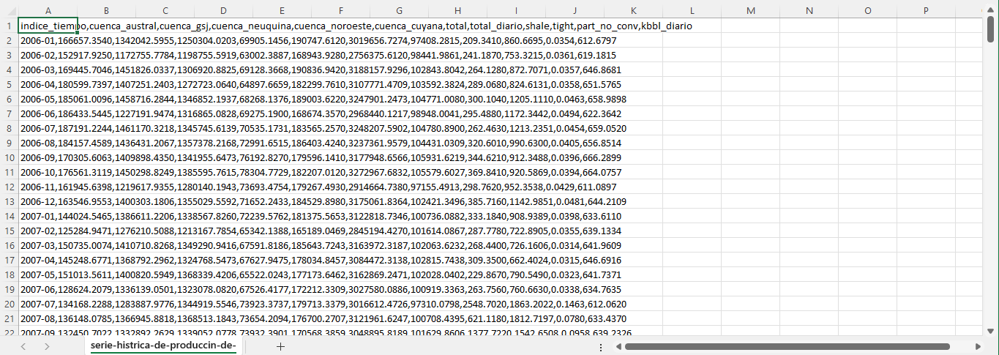

# 📊 YPF S.A.: Financial Resilience & Market Dynamics Analysis (2011–2023)

## 📌 Executive Summary
This end-to-end data analytics project evaluates the financial performance and top-line revenue dynamics of **YPF S.A.** (Argentina's leading energy company) over a 13-year period (2011–2023). By consolidating multi-source financial statements, macroeconomic exchange rate indicators, and global energy market benchmarks (Brent Crude). The project identifies key drivers behind revenue fluctuations and operational profitability (EBITDA margin).

---

## 🛠️ Tech Stack & Architecture
* **Data Processing & Cleaning:** Microsoft Excel (Multi-source normalization, date standardization, and initial data profiling).
* **Data Warehouse & ETL:** Google BigQuery (SQL)
* **Data Visualization:** Google Looker Studio
* **Data Processing Techniques:** Advanced SQL (`CREATE VIEW`, Window Functions, `LEFT JOIN`, `COALESCE`), Currency Conversions (ARS to USD), Time Series Aggregations.
* **Version Control:** GitHub

---

## 📈 Executive Dashboard

### Key Metrics Summary (2011–2023 Averages):
* **Average Top-Line Revenue:** `$3.31B USD`
* **Average EBITDA Margin:** `29.06%`
* **Average Brent Crude Price:** `$77.60 USD`

---

## 🧹 Data Cleaning & Preprocessing (Excel)
Before loading datasets into BigQuery, critical data preparation steps were executed in Excel:
* **Format Normalization:** Standardized heterogeneous currency formats (ARS/USD), unified regional number settings, and aligned date formats across multi-year financial statements.
* **Accounting Validation:** Verified numeric consistency across revenue, cost, and EBITDA metrics to ensure seamless ingestion into SQL schemas.
* **Dataset Curation:** Filtered out unverified records and structured raw tables into clean CSV layouts.

---

## 🚨 Data Governance & Quality Audit Note
* **Initial Project Scope:** The initial hypothesis aimed to evaluate USD Revenue sensitivity against physical operational volumes (Total Crude Oil & Gas Production in BOE) through 2025.
* **Data Quality Issue:** During Excel profiling and BigQuery staging, severe schema anomalies and date-indexing corruptions were detected (e.g., date fields defaulting heavily to `2013-01-XXX`, accompanied by critical data gaps in post-2023 records).

### 🔍 Audit Evidence (Corrupted Production Dataset)

*Figure 1: Sample of raw production dataset showing structural anomalies, invalid date indexing (`2013-01-XXX`), and missing historical values.*

* **Methodological Decision:** Applying the *Data Quality First* principle, the analysis was capped at **2023**, and the corrupted operational volume table was strictly excluded from Version 1.0 to preserve 100% reporting integrity. Physical production pipeline fixes are logged in the project backlog for V2.0.

---

## 🔍 Key Business Insights
1. **Revenue Elasticity vs. Brent Crude:** YPF's top-line revenue in USD displays a strong positive correlation with global Brent Crude price cycles. Spikes in international oil prices directly drive revenue peaks.
2. **Operational Resilience (EBITDA Margin):** Despite high macroeconomic and exchange rate volatility in Argentina, YPF maintained an average EBITDA margin of 29.06%, demonstrating core operational efficiency across commodity price downturns.
3. **FX Impact on Top-Line:** Conversion of ARS financial records to USD highlights the importance of evaluating corporate growth in hard currency to filter out local inflationary distortions.

---

## 📂 Repository Structure
* `data/`: Raw and cleaned datasets (Excel / CSV format).
* `sql/`: BigQuery transformation and aggregation scripts.
* `docs/`: Visual assets, audit evidence, and dashboard layout references.
